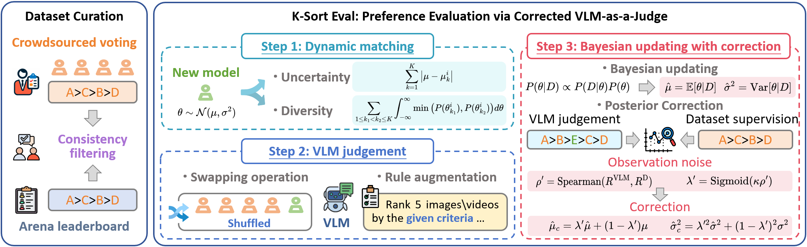

<div align="center">
<h1>  K-Sort Eval: Efficient Preference Evaluation for Visual Generation via Corrected VLM-as-a-Judge</h1>  

<a href="https://arxiv.org/abs/">
  
</a>
<a href="https://huggingface.co/datasets/ksort/K-Sort-Eval">
    
</a>
</div>

This repo contains the official code of the paper: [K-Sort Eval: Efficient Preference Evaluation for Visual Generation via Corrected VLM-as-a-Judge](https://arxiv.org/abs/). K-Sort Eval utilizes **Corrected VLM-as-a-Judge** to achieve efficient and reliable evaluation for visual generation, including text-to-image and text-to-video models.
<div align=center>
  
  </div>

### News
- [25/04] We release K-Sort Eval code in this repo.
- [25/04] We release K-Sort Eval dataset at [Huggingface](https://huggingface.co/datasets/ksort/K-Sort-Eval).

---

### Setup
- To clone this repo and develop locally:
```bash
  git https://github.com/zkkli/K-Sort-Eval.git
  cd K-Sort-Eval
```
- The dataset will be automatically downloaded from HuggingFace, without manual action.

---

### Evaluation of Text-to-Image Models
1.  Add the inference code of the model to be evaluated in [generate_image.py](generate_image.py)
```bash
width = 512
height = 512
image = ...
image.save(save_path)
```
2.  You can directly run [scripts/run_eval_image.sh](./scripts/run_eval_image.sh), or use the following command:
```bash
export OPENAI_API_KEY=[your-API-Token]
python ksort_eval_image.py --dataset_path [/path-to-dataset/] --log_path [/path-to-save-log/] --exp_name [exp_name] --alpha [alpha]--sigmoid_k [sigmoid_k]

Arguments:
[your-API-Token] (required): Your OpenAI API Key.
--dataset_path (required): Path to local dataset downloaded from Huggingface.
--log_path: Path to save logs, default="./log_results".
--exp_name: Experiment Name, default="exp_name".
--alpha: Coefficient of alpha, default=0.5.
--sigmoid_k: Coefficient of sigmoid_k, default=5.0.
```

### Evaluation of Text-to-Video Models
1.  Add the inference code of the model to be evaluated in [generate_video.py](generate_video.py)
```bash
width = 512
height = 512
duration = 5
fps = 8
video = ...
export_to_video(video, save_path, fps=fps)
```
2.  You can directly run [scripts/run_eval_video.sh](./scripts/run_eval_video.sh), or use the following command:
```bash
export DASHSCOPE_API_KEY=[your-API-Token]
python ksort_eval_video.py --dataset_path [/path-to-dataset/] --log_path [/path-to-save-log/] --exp_name [exp_name] --alpha [alpha]--sigmoid_k [sigmoid_k]

Arguments:
[your-API-Token] (required): Your Qwen API Key.
--dataset_path (required): Path to local dataset downloaded from Huggingface.
--log_path: Path to save logs, default="./log_results".
--exp_name: Experiment Name, default="exp_name".
--alpha: Coefficient of alpha, default=0.5.
--sigmoid_k: Coefficient of sigmoid_k, default=5.0.
```